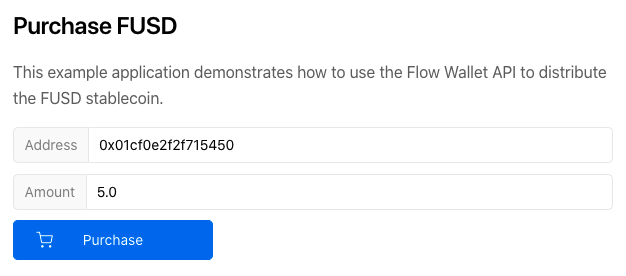

# Next.js FUSD Provider Example

This example application demonstrates how to use the Flow Wallet API
to distribute the FUSD stablecoin.



## Usage

### Start the API

This example uses the sample emulator configuration 
from the root of this repository.

Create a configuration file:

```sh
cp .env.example .env
```

Start the Wallet API, Flow Emulator and Postgres:

```sh
docker-compose up -d
```

Deploy the FUSD contract to the emulator:

```sh
flow project deploy -n emulator
```

### Start the app

In this directory, install and run the Next.js app:

```bash
npm install

npm run dev
```

Try the application at http://localhost:3001!
